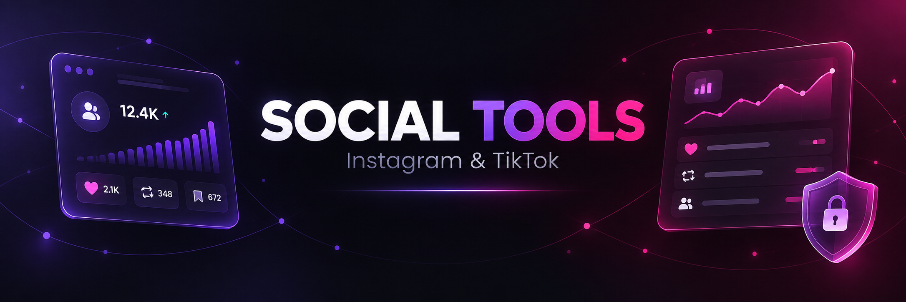

<h1 align="center">Social Tools</h1>

<p align="center">Extensão para Chrome com ferramentas locais para organizar Instagram e TikTok.</p>

<p align="center">
  
  
  
</p>

<div align="center">
  
</div>

## Recursos

| Rede | Ferramenta | O que faz |
| --- | --- | --- |
| Instagram | Quem não segue de volta | Compara seguidores e seguindo do perfil aberto. |
| TikTok | Removedor de curtidas | Lê as curtidas da conta conectada e permite remover todas ou uma quantidade definida. |
| TikTok | Removedor de reposts | Lê os reposts da conta conectada e permite desfazer todos ou uma quantidade definida. |

## Diferenciais

- Escolha entre analisar todos os itens ou somente uma quantidade específica.
- Confirmação obrigatória antes de remover curtidas ou reposts.
- Progresso durante a leitura das listas do TikTok.
- Validação após a remoção de curtidas para evitar informar sucesso sem confirmação.
- Processamento local no navegador, sem senha e sem servidor próprio.

## Instalação

1. Baixe ou clone este projeto.
2. Abra `chrome://extensions` no Google Chrome.
3. Ative o **Modo do desenvolvedor**.
4. Clique em **Carregar sem compactação**.
5. Selecione a pasta `instagram-nao-seguidores`.

## Como usar

1. Entre na sua conta do Instagram ou TikTok pelo navegador.
2. Abra a rede desejada em uma aba.
3. Clique no ícone do **Social Tools**.
4. Escolha a rede e a ferramenta.
5. No TikTok, selecione **Todos** ou **Escolher quantidade** antes de analisar.
6. Revise o resultado e confirme a remoção quando desejar continuar.

## Privacidade

Os dados são consultados na sessão que já está aberta no navegador. A extensão não solicita senha, não salva listas em servidor próprio e não compartilha dados com terceiros.

## Estrutura

```text
instagram-nao-seguidores/
├── assets/
│   ├── banner-social-tools.png
│   ├── icon-16.png
│   ├── icon-32.png
│   ├── icon-48.png
│   ├── icon-128.png
│   └── logo-analisador.svg
├── background.js
├── content.js
├── manifest.json
├── popup.css
├── popup.html
├── popup.js
└── README.md
```

---

<p align="center">Feito para organizar suas redes com mais controle.</p>
